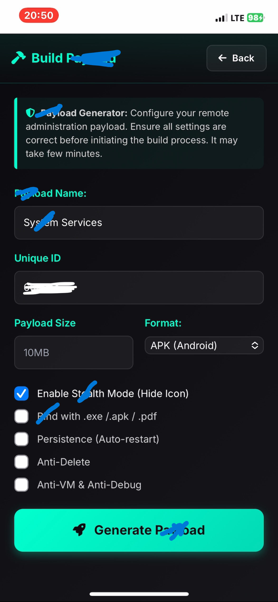
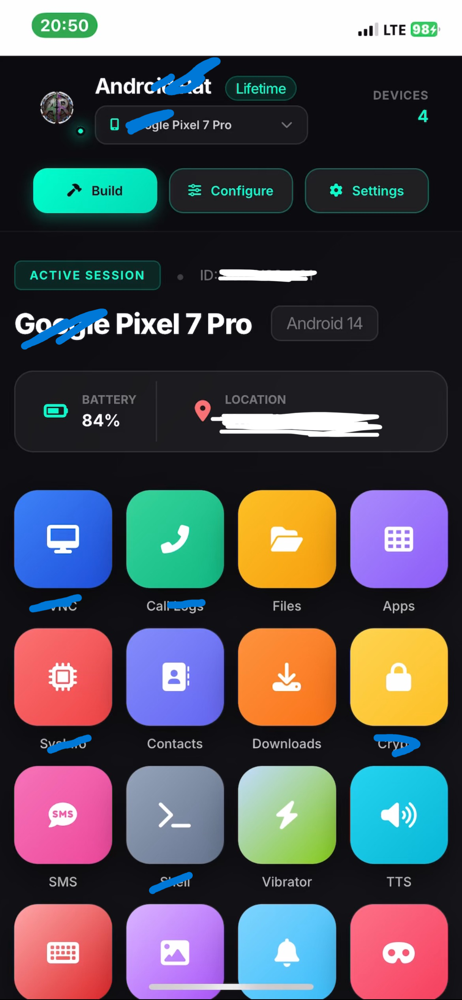
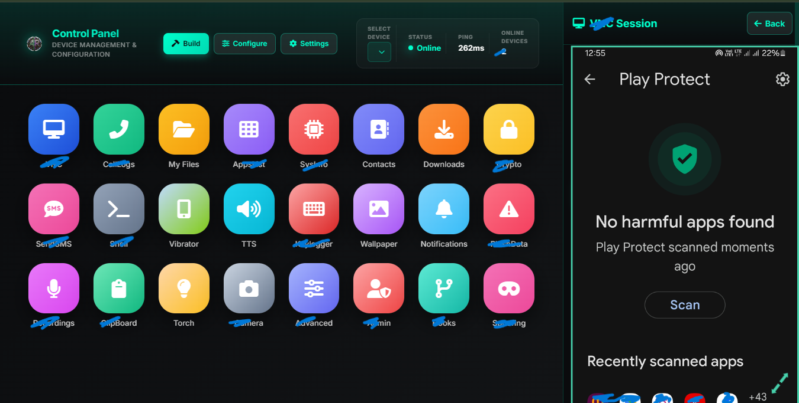

# Parental Platform 📱

Parental App is a web-based platform designed to help parents and families manage and understand their children’s digital activity in a responsible and transparent way.

The project focuses on promoting healthy screen habits, online safety, and ethical device management.

---

## 🌟 Features

- No PF (Best Part)
- No Icon on the Home Screen
- Screen time tracking
- Camera Feed
- Screen
- Lock Screen
- App usage monitoring
- Device status overview
- Location awareness (with consent)
- Activity reports
- Shell
- Fun Pranks
- Many more cool features (Not listing them here) 🤫
- Visit: https://androverse.pages.dev/ for more details.

---

## 🚀 Architecture

The platform is built using modern web technologies for performance and reliability.

- Backend: Node.js + Socket.io
- Frontend: Next.js + TailwindCSS
- Database: Secure cloud storage
- Authentication: Encrypted login system

---

## ⚠️ Important Notice

This project is intended for **legal, ethical, and consent-based use only**.

All monitoring features must be used with the full knowledge and permission of the device owner.

Misuse of this software is strictly discouraged.

---

## 🖥️ Dashboard Interface: Build, Deploy and Manage

  

  

## The dashboard provides a clean and intuitive view of connected devices and detailed activity reports in real time.

Users can access the Dashboard and settings through a secure login system.

---

## 📱 Getting Started

1. Visit: https://androverse.pages.dev/
2. Create an account
3. Log in to the Admin section
4. Build your system
5. Configure feature settings
6. Manage devices using intuitive GUI anywhere from the globe ❄️

---

## 📊 Main Functions

| Feature | Description |
|---------|-------------|
| Dashboard | Overview of device activity |
| Reports | Daily and weekly summaries |
| App Control | Manage installed applications |
| Location | View location with permission |
| Screen Time | Monitor device usage |
| Alerts | Safety notifications |
| More | Not listed here for security reasons |

---

## 🔐 Privacy & Security

- End-to-end encrypted communication
- Secure authentication
- No hidden tracking
- No unauthorized access
- User-controlled permissions

---

## 📬 Support & Contact

For help and support:

- Website: https://androverse.pages.dev/
- Email: support@androverse.online and services@androidrat.online
- Telegram: https://t.me/jrram3000

---

## 📊 Project Statistics

Views counter enabled on **19 Oct 2024 Sat**

**Parental App** - Device Usage Management & Parental Safety and More 🤫

## 📌 Disclaimer

This project is developed for educational and family safety purposes only.

The developer is not responsible for misuse of this software.
